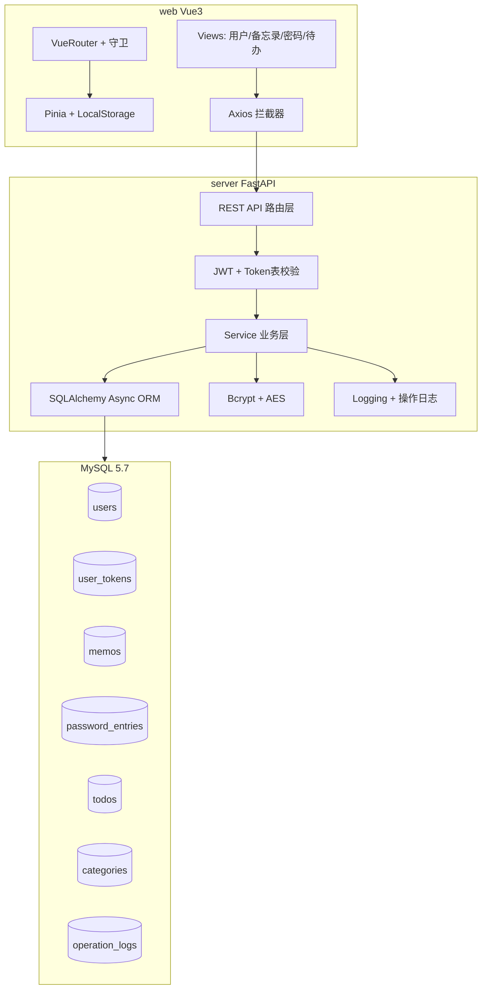
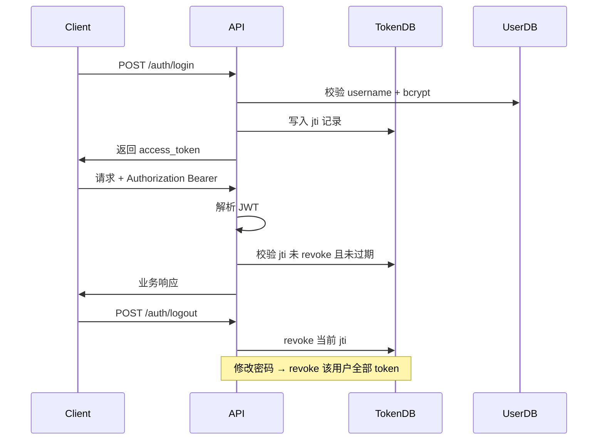

# 小智工具箱（wizzy）全栈构建计划

## 现状

工作区 [`c:\vscode\wizzy`](c:\vscode\wizzy) 为空白项目，仅存在 [`wizzy-构建提示词.txt`](wizzy-构建提示词.txt)。需从零生成 `./web`、`./server`、`./deploy`、`./doc` 及根目录配置与文档。

**已确认决策：**
- 前端校验：Element Plus 表单 `rules`，规则与后端 Pydantic Schema 对齐
- 用户注册：仅 admin 在用户管理页创建用户，无公开注册页

---

## 目标目录结构

```text
wizzy/
├── .gitignore
├── readme.md
├── web/                    # Vue3 前端
│   ├── readme.md
│   ├── package.json
│   ├── vite.config.js
│   └── src/
│       ├── api/            # Axios 模块
│       ├── components/     # 公共组件
│       ├── layouts/        # 主布局（侧栏+顶栏）
│       ├── router/         # 路由 + 守卫
│       ├── stores/         # Pinia
│       ├── utils/          # 加密脱敏、时间、PDF 等
│       └── views/          # 页面
├── server/                 # FastAPI 后端
│   ├── readme.md
│   ├── requirements.txt
│   ├── .env.example
│   ├── main.py
│   ├── app/
│   │   ├── core/           # 配置、安全、异常、日志
│   │   ├── models/         # SQLAlchemy ORM
│   │   ├── schemas/        # Pydantic
│   │   ├── api/            # 路由
│   │   ├── services/       # 业务逻辑
│   │   └── utils/          # 加解密、PDF 等
│   └── scripts/
│       ├── init_db.sql     # 建表 + 种子数据
│       └── seed_data.py    # 可选 Python 种子脚本
├── deploy/                 # Ubuntu 22 一键部署
│   ├── install.sh
│   ├── nginx.conf
│   └── systemd/            # 后端 service 单元
└── doc/
    ├── 后端技术架构.md
    ├── 后端程序流程.md
    ├── 数据库说明.md
    ├── deploy.md
    ├── 手工部署.md
    └── 开发环境测试说明.md
```

---

## 系统架构



---

## 数据库设计

| 表名 | 用途 | 关键字段 |
|------|------|----------|
| `users` | 用户账号 | `username`, `password_hash`, `role`(admin/user), `is_active`, `created_at` |
| `user_tokens` | JWT 白名单/失效管理 | `user_id`, `jti`, `expires_at`, `is_revoked` |
| `categories` | 备忘录/密码/待办共用分类 | `user_id`, `module_type`(memo/password/todo), `name` |
| `memos` | 备忘录 | `user_id`, `category_id`, `title`, `content`, `is_pinned` |
| `password_entries` | 密码本 | `user_id`, `category_id`, `site_name`, `username`, `password_enc`, `url`, `remark` |
| `todos` | 待办 | `user_id`, `category_id`, `title`, `priority`, `status`, `due_at`, `completed_at` |
| `operation_logs` | 高危操作审计 | `user_id`, `action`, `module`, `detail`, `ip`, `created_at` |

**行级隔离：** 所有业务表含 `user_id` 外键；Service 层强制 `WHERE user_id = current_user.id`（admin 用户管理模块除外）。

**预置用户（Bcrypt 哈希）：**
- `admin` / `Admin@123` — role=admin
- `user` / `User@123` — role=user

**种子数据：** admin 与 user 各拥有若干分类、备忘录、密码条目（AES 加密入库）、待办（含 overdue/pending/completed 多种状态）。

初始化脚本：[`server/scripts/init_db.sql`](server/scripts/init_db.sql) 建库建表；[`server/scripts/seed_data.py`](server/scripts/seed_data.py) 写入哈希密码与 AES 密文（避免 SQL 中硬编码二进制）。

---

## 后端实现要点（FastAPI）

### 分层结构

- **core/config.py** — 从 `.env` 读取 `DATABASE_URL`, `JWT_SECRET`, `AES_KEY`, `CORS_ORIGINS`
- **core/security.py** — Bcrypt 哈希、JWT 签发/解析（含 `jti`）、Token 表校验与批量 revoke
- **core/exceptions.py + middleware** — 统一响应格式 `{ code, message, data }`
- **core/deps.py** — `get_current_user`, `require_admin` 依赖注入

### 鉴权流程



### API 模块划分

| 前缀 | 功能 | 权限 |
|------|------|------|
| `/api/auth` | 登录、登出、修改密码、当前用户信息 | 登录用户 |
| `/api/users` | 用户 CRUD、启用/禁用、强制下线 | admin |
| `/api/memos` | CRUD、分页、关键词搜索、PDF 导出 | 登录用户（仅自身数据） |
| `/api/passwords` | CRUD、分类、查看明文（二次校验密码）、加密备份导出 | 登录用户 |
| `/api/todos` | CRUD、批量更新状态、逾期筛选 | 登录用户 |
| `/api/categories` | 按 module_type 管理分类 | 登录用户 |
| `/api/logs` | 操作日志分页查询 | admin 看全部；user 看自身 |

### 关键业务规则

- **密码本 AES：** 使用 `cryptography` 库 Fernet/AES-GCM；密钥来自环境变量；列表接口返回脱敏字段（`****`），查看明文需 POST 当前登录密码二次校验并写操作日志
- **备忘录 PDF：** 后端 `reportlab` 或 `fpdf2` 生成 PDF 流，`StreamingResponse` 返回；前端也可 JsPDF 本地导出作为补充
- **待办逾期：** 查询时计算 `due_at < now() AND status != completed` 标记 `is_overdue`；支持按 status/priority/日期范围筛选
- **高危操作日志：** 删除密码、导出备份、admin 禁用用户、批量删除等待统一写入 `operation_logs`

### 技术选型

- FastAPI + Uvicorn（async）
- SQLAlchemy 2.x async + aiomysql
- Pydantic v2 请求/响应模型
- python-jose 或 PyJWT + passlib[bcrypt] + cryptography

---

## 前端实现要点（Vue3）

### 主布局 [`web/src/layouts/MainLayout.vue`](web/src/layouts/MainLayout.vue)

- **左侧边栏：** 二级菜单结构
  - 用户管理（`v-if="user.role === 'admin'"`）
  - 备忘录
  - 密码本
  - TodoList 待办
- **顶栏：** 暗色模式切换（Element Plus dark CSS vars + Pinia 持久化）、设置 Dropdown（用户信息 / 修改密码 / 退出登录）
- **内容区：** `<router-view>`

### 路由与守卫 [`web/src/router/index.js`](web/src/router/index.js)

- 白名单：`/login`
- 全局 `beforeEach`：无 token 跳转登录；admin 路由拦截非 admin
- 401 响应：Axios 拦截器清 token 并跳转登录

### Pinia Stores

- **authStore** — token、userInfo（username/role/id，不含敏感明文）；持久化到 LocalStorage
- **appStore** — darkMode、侧边栏折叠状态

### 页面清单

| 路由 | 页面 | 功能 |
|------|------|------|
| `/login` | LoginView | 账号密码登录 |
| `/users` | UserManageView | admin：表格 CRUD、禁用、重置密码 |
| `/memos` | MemoListView | 列表+搜索+分页+分类筛选；弹窗增改；草稿 LocalStorage；PDF 导出 |
| `/passwords` | PasswordListView | 脱敏列表；查看/复制需二次密码；分类；加密 JSON 备份下载 |
| `/todos` | TodoListView | 看板或表格；优先级/状态/逾期标签；批量完成；日期筛选 |

### 公共组件

- `PageHeader`, `ConfirmDialog`, `CategorySelect`, `SearchBar`, `ExportButton`
- 统一表格/表单样式封装

### 工具模块 [`web/src/utils/`](web/src/utils/)

- `request.js` — Axios 实例 + 拦截器 + ElMessage 全局错误
- `crypto.js` — CryptoJS 前端脱敏展示辅助
- `date.js` — Dayjs 格式化
- `pdf.js` — JsPDF 备忘录导出
- `storage.js` — 备忘录草稿 LocalStorage（key 含 userId）

### Vite 配置

- 开发代理：`/api` → `http://127.0.0.1:8000`
- Element Plus 按需或全量引入

---

## 部署方案

### [`deploy/install.sh`](deploy/install.sh)（Ubuntu 22 一键部署）

1. 安装依赖：Python 3.10+、Node 18+、MySQL 5.7、Nginx
2. 创建 MySQL 库与用户，执行 `init_db.sql` + `seed_data.py`
3. 后端：venv + pip install + systemd 服务（Uvicorn 8000）
4. 前端：`npm ci && npm run build`，静态文件至 `/var/www/wizzy`
5. Nginx 反向代理：`/` → 静态资源，`/api` → FastAPI
6. 复制 `.env.example` → `.env` 并提示修改密钥

### 文档

- [`doc/deploy.md`](doc/deploy.md) — 一键脚本逻辑逐步说明
- [`doc/手工部署.md`](doc/手工部署.md) — 分步手工部署（Win 开发 / Ubuntu 生产）
- [`doc/开发环境测试说明.md`](doc/开发环境测试说明.md) — Win11 本地：MySQL 安装、`.env` 配置、`uvicorn` + `npm run dev`、各模块测试用例清单

---

## 安全与规范

- `.gitignore`：忽略 `node_modules/`, `__pycache__/`, `.env`, `dist/`, `*.pyc`, `.venv/`, IDE 配置
- 敏感明文禁止 LocalStorage（密码本明文仅内存短暂持有）
- CORS 限定开发/生产域名
- 所有文件顶部功能注释 + 关键方法/docstring 中文注释

---

## 实施顺序（建议分 6 阶段）

### Phase 1 — 项目脚手架
根目录 `.gitignore`、`readme.md`；初始化 `web`（Vite+Vue3+Element Plus+Pinia+Router）与 `server`（FastAPI 骨架、统一响应、CORS、Swagger）。

### Phase 2 — 认证与用户模块
数据库模型与迁移脚本；登录/登出/JWT+Token 表；admin 用户管理 CRUD；前端登录页 + 主布局 + 路由守卫。

### Phase 3 — 备忘录模块
分类 CRUD；备忘录 CRUD + 分页搜索；草稿 LocalStorage；PDF 导出（前后端各一条路径）。

### Phase 4 — 密码本模块
AES 加解密 Service；脱敏列表 + 二次密码校验查看明文；加密备份导出；操作日志。

### Phase 5 — TodoList 模块
待办 CRUD + 状态流转 + 优先级 + 逾期判定 + 批量更新 + 多条件筛选。

### Phase 6 — 部署与文档
`deploy/` 脚本；`doc/` 六份文档；`web/readme.md`、`server/readme.md`；种子数据完善；Win11 联调测试。

---

## 本地开发快速启动（Win11）

```bash
# 后端
cd server
python -m venv .venv
.venv\Scripts\activate
pip install -r requirements.txt
copy .env.example .env   # 配置 MySQL 与密钥
python scripts/seed_data.py
uvicorn main:app --reload --port 8000

# 前端
cd web
npm install
npm run dev   # 默认 http://localhost:5173
```

登录：`admin / Admin@123` 或 `user / User@123`
