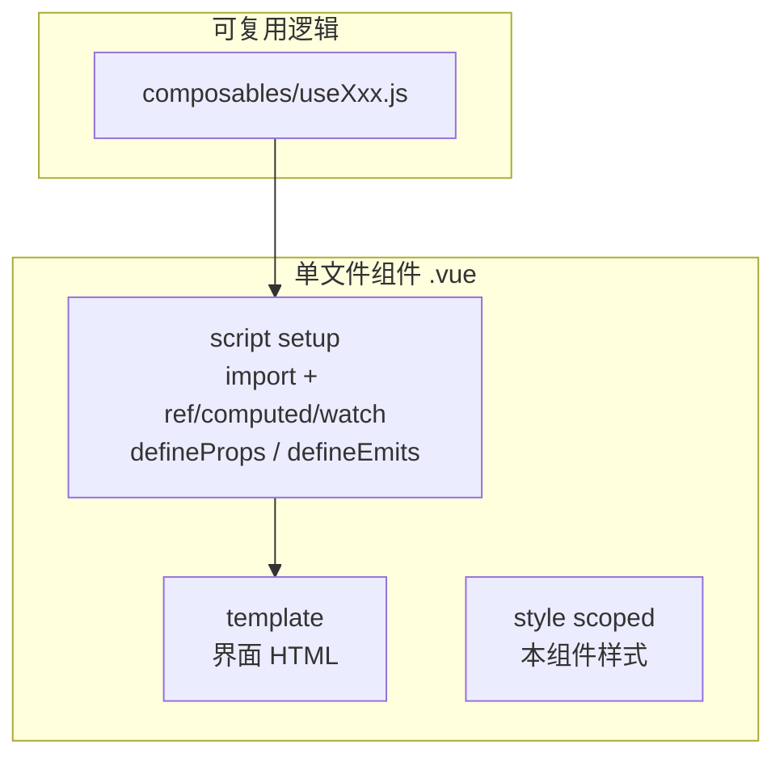

# Composition API & `<script setup>` 学习 Demo

> 在 [ViteVue3_demo](../ViteVue3_demo/) 基础上，**专门讲清楚** Vue 3 的组合式 API 和 `<script setup>` 怎么写、为什么这样写。零基础可按页面从上到下、配合源码逐课学习。

---

## 一、先看目录结构

```
demo/前端/APIAndScriptSetup_demo/
├── index.html
├── vite.config.js          # 开发端口 5175
├── package.json
├── README.md               # 本文件（文字教程）
├── src/
│   ├── main.js             # 入口（与 ViteVue3_demo 相同）
│   ├── App.vue             # 九课导航 + 各课时容器
│   ├── style.css
│   ├── composables/
│   │   └── useMouse.js     # 第 9 课：组合式函数
│   └── components/
│       ├── OptionsVsComposition.vue
│       ├── OptionsCounter.vue        # 选项式 API（对比用）
│       ├── CompositionCounter.vue    # 组合式 API（推荐）
│       ├── ScriptSetupDemo.vue       # 第 2 课
│       ├── LessonRef.vue             # 第 3 课
│       ├── LessonReactive.vue        # 第 4 课
│       ├── LessonComputed.vue        # 第 5 课
│       ├── LessonWatch.vue           # 第 6 课
│       ├── LessonLifecycle.vue       # 第 7 课
│       ├── LifecycleChild.vue
│       ├── LessonPropsEmit.vue       # 第 8 课
│       ├── ChildGreeting.vue
│       └── LessonComposable.vue      # 第 9 课
```

**学习路径建议**：

```
ViteVue3_demo（Vue + Vite 是什么）
        ↓
APIAndScriptSetup_demo（本 demo：怎么写逻辑）
        ↓
web/ 正式项目（Router + Pinia + 调接口）
```

---

## 二、Composition API 是什么？

Vue 组件 = **模板（界面）** + **逻辑（数据、函数）**。

| 写法 | 逻辑放在哪 | 现状 |
|------|-----------|------|
| **Options API** | `data`、`methods`、`computed` 等选项里 | Vue 2 主流，Vue 3 仍支持 |
| **Composition API** | `setup()` 函数或 `<script setup>` 里 | Vue 3 **推荐** |

**为什么要组合式？**

1. **相关逻辑写在一起**：计数器的 `count`、`double`、`add` 都在一块，不用在 `data` / `computed` / `methods` 之间跳。
2. **更好复用**：抽成 `useMouse()`、`useUser()` 等函数，比 mixin 清晰。
3. **TypeScript 友好**：类型推导更简单（本 demo 用 JS，正式项目 `web/` 可逐步加 TS）。

本 demo 第 1 课页面上有两个计数器，左边 Options、右边 Composition，**功能相同**，请对照源码感受差异。

---

## 三、`<script setup>` 是什么？

普通组合式要先写：

```js
export default {
  setup() {
    const count = ref(0)
    return { count }  // 必须 return，模板才能用
  },
}
```

`<script setup>` 是**语法糖**，编译器帮你做了 `return`：

```vue
<script setup>
import { ref } from 'vue'
const count = ref(0)
// 顶层变量、函数、import 的组件 → 自动给模板用
</script>
```

**记住三条**：

1. 文件里写 `<script setup>`，**不要**再写 `export default`。
2. **顶层**声明的变量、函数，模板里直接用。
3. `import Xxx from './Xxx.vue'` 的组件，模板里直接 `<Xxx />`，无需 `components: { Xxx }`。

本仓库 `web/` 里几乎所有 `.vue` 都是这种写法。

---

## 四、九课核心 API 速查（小白版）

### 第 3 课 · `ref`

```js
import { ref } from 'vue'
const count = ref(0)
count.value++           // JS 里要 .value
// 模板：{{ count }}    不要 .value
```

适合：数字、字符串、布尔，或「整个变量会被替换成新对象」。

### 第 4 课 · `reactive`

```js
import { reactive } from 'vue'
const user = reactive({ name: '小红', age: 20 })
user.name = '小明'      // 改属性，不要 .value
// user = { ... }      // ❌ 整体赋值会丢响应式
```

适合：对象、数组，且不会整体换掉引用。

### 第 5 课 · `computed`

```js
import { computed } from 'vue'
const total = computed(() => price.value * quantity.value)
```

**派生数据**：依赖不变就不重算。模板里当普通变量用 `{{ total }}`。

### 第 6 课 · `watch` / `watchEffect`

```js
watch(keyword, (newVal, oldVal) => {
  console.log('关键词变了', newVal)
})

watchEffect(() => {
  console.log('当前条数', list.value.length)  // 自动收集 list 依赖
})
```

**副作用**：数据变了要去打日志、请求接口、存 localStorage 时用。

### 第 7 课 · 生命周期

| 钩子 | 时机 | 常见用途 |
|------|------|----------|
| `onMounted` | 组件出现在 DOM 后 | 请求数据、绑定事件、开定时器 |
| `onUnmounted` | 组件销毁前 | 清定时器、解绑事件 |

```js
import { onMounted, onUnmounted } from 'vue'

onMounted(() => { /* ... */ })
onUnmounted(() => { /* 清理 */ })
```

### 第 8 课 · `defineProps` / `defineEmits`

只在 `<script setup>` 里用，**不用 import**：

```js
const props = defineProps({ name: String, level: Number })
const emit = defineEmits(['update-level'])

emit('update-level', props.level + 1)
```

父组件：

```vue
<Child :name="parentName" :level="level" @update-level="level = $event" />
```

与 [ViteVue3_demo 的 Counter.vue](../ViteVue3_demo/src/components/Counter.vue) 同一套，这里讲得更细。

### 第 9 课 · composable（`useXxx`）

把逻辑抽到 `src/composables/useMouse.js`：

```js
export function useMouse() {
  const x = ref(0)
  // onMounted 绑事件、onUnmounted 解绑 ...
  return { x, y }
}
```

组件里：

```js
const { x, y } = useMouse()
```

---

## 五、一张图：`.vue` 文件里代码怎么组织



---

## 六、和 ViteVue3_demo / web/ 的对应

| 本 Demo | ViteVue3_demo | web/ 正式项目 |
|---------|---------------|---------------|
| 九课分组件讲解 | 一个 App 演示 v-model、v-for | views 里完整页面 |
| `LessonPropsEmit` | `Counter.vue` | 各业务组件 |
| `useMouse.js` | （无） | 可自建 `composables/` |
| 全部 `<script setup>` | 已用 script setup | 全部 script setup |
| 端口 **5175** | 端口 **5174** | 端口 **5173** |

你在 `web/src/views/` 里看到的：

```vue
<script setup>
import { ref, onMounted } from 'vue'
import { getMemos } from '@/api/memos'
// ...
</script>
```

就是本 demo 这些知识点拼在一起，再加 Router、Pinia、Element Plus。

---

## 七、如何运行

### 前置条件

- 已安装 [Node.js](https://nodejs.org/)（LTS）
- **建议先跑通** [ViteVue3_demo](../ViteVue3_demo/)

### 步骤

```bash
cd demo/前端/APIAndScriptSetup_demo
npm install
npm run dev
```

浏览器打开：**http://127.0.0.1:5175**

页顶有九课快捷按钮，可跳转；改 `src/components/Lesson*.vue` 保存后热更新。

### 打包（可选）

```bash
npm run build
npm run preview
```

---

## 八、建议学习顺序（配合源码）

1. 跑起来 `npm run dev`，从第 1 课滚到第 9 课，每个按钮都点一点。
2. 打开 `src/App.vue`，看如何 `import` 各课时组件。
3. 按课阅读：
   - `LessonRef.vue` → `LessonReactive.vue` → `LessonComputed.vue`
   - `LessonWatch.vue` → `LessonLifecycle.vue`
   - `LessonPropsEmit.vue` + `ChildGreeting.vue`
   - `composables/useMouse.js` + `LessonComposable.vue`
4. 对比 `OptionsCounter.vue` 与 `CompositionCounter.vue`。
5. 打开 `web/src/views/` 任选一个 `.vue`，找出里面的 `ref`、`computed`、`onMounted`。

---

## 九、自己动手练

1. **改 ref**：在 `LessonRef.vue` 把初始 `count` 改成 10，看页面变化。
2. **加 computed**：在 `LessonComputed.vue` 加一个「含折扣 8 折」的 `discountedTotal`。
3. **写 watch**：在 `LessonWatch.vue` 当 `keyword` 为空时清空日志。
4. **新 composable**：新建 `useCounter.js`，返回 `{ count, increment }`，在任意 Lesson 里用。
5. **新子组件**：仿 `ChildGreeting.vue` 做一个 `TagList`，props 接收 `tags` 数组，emit `select`。
6. **对照正式项目**：在 `web/` 搜索 `script setup`，统计用了哪些 API。

---

## 十、常见问题

**Q：ref 和 reactive 到底选哪个？**  
简单值用 `ref`；对象/数组且不会整体替换用 `reactive`；拿不准时用 `ref` 包对象也行（`user.value.name`）。

**Q：模板里为什么有时不用 .value？**  
Vue 在模板里自动解包 `ref`；在 `<script setup>` 的普通 JS 里必须 `.value`。

**Q：defineProps 为什么要用 const props =？**  
可以 `defineProps({...})` 不接变量；需要把 props 传给别的函数时再用 `const props = defineProps(...)`。

**Q：和 ViteVue3_demo 重复吗？**  
ViteVue3_demo 讲「项目怎么跑、模板指令有哪些」；本 demo 讲「script 里逻辑怎么组织」。互补，不重复。

**Q：下一步学什么？**  
- [Vue 官方 · 组合式 API](https://cn.vuejs.org/guide/extras/composition-api-faq.html)  
- [Vue 官方 · script setup](https://cn.vuejs.org/api/sfc-script-setup.html)  
- 本仓库 `web/src/router/`（路由）、`web/src/stores/`（Pinia）

---

## 十一、一句话总结

**`<script setup>` 里用 `ref` / `reactive` 存数据，用 `computed` 算展示，用 `watch` 做副作用，用 `onMounted` 处理加载与清理，用 `defineProps` / `defineEmits` 和父组件通信，用 `useXxx` 复用逻辑** —— 这就是现代 Vue 3 组件的标准写法。
