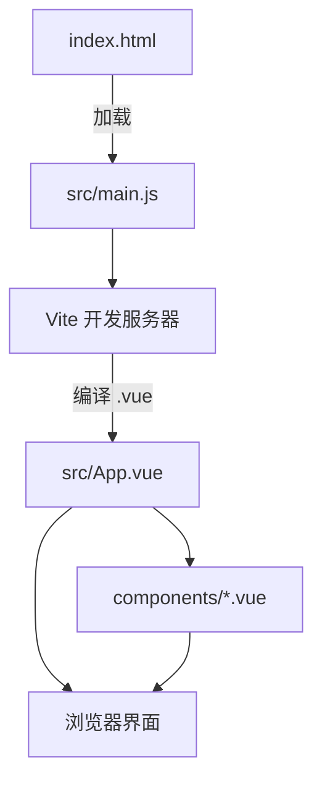

# Vue 3 + Vite 最简 Demo

> 用最少的文件，把「浏览器怎么跑起一个 Vue 页面」讲清楚。学完再去看本仓库 `web/` 正式前端，就不会被 Router、Pinia、Element Plus 一起砸懵了。

---

## 一、先看目录结构

```
demo/前端/ViteVue3_demo/
├── index.html              # 浏览器真正打开的文件（入口 HTML）
├── vite.config.js          # Vite 配置（开发服务器、插件）
├── package.json            # 依赖与 npm 脚本
├── src/
│   ├── main.js             # JS 入口：创建 Vue 应用并挂载
│   ├── App.vue             # 根组件（页面骨架）
│   ├── style.css           # 全局样式
│   └── components/
│       └── Counter.vue     # 子组件示例（props + 事件）
└── README.md               # 本文件
```

**和 Python 后端的类比**（如果你已经看过 `demo/后端/FastAPI_demo/`）：

| 前端 | 后端 FastAPI |
|------|--------------|
| `index.html` | 没有直接对应，相当于「浏览器访问的地址」 |
| `main.js` | `main.py`（程序入口） |
| `App.vue` | 根路由 / 页面容器 |
| `components/*.vue` | 可复用的「页面片段」，类似拆出来的函数或模块 |
| `vite.config.js` | uvicorn 启动参数 + 中间件配置 |
| `package.json` | `requirements.txt` + 启动命令 |

---

## 二、Vue 和 Vite 分别是什么？

### Vue 3 —— 写页面的框架

- 把页面拆成 **组件**（`.vue` 文件），每个组件有 **模板**（HTML）、**逻辑**（JS）、**样式**（CSS）。
- 数据变了，界面 **自动更新**，不用手写 `document.getElementById(...).innerText = ...`。
- 本 demo 使用 **组合式 API**（`<script setup>` + `ref`），和 `web/` 正式项目一致。

### Vite —— 开发时的「构建工具」

- 开发时：`npm run dev` 启动本地服务器，改代码 **秒级热更新**。
- 上线前：`npm run build` 把 `.vue`、现代 JS 打包成浏览器能直接打开的静态文件（在 `dist/` 目录）。
- 你可以把 Vite 理解成：**专门伺候 Vue/React 等现代前端的、更快的开发服务器 + 打包器**。

---

## 三、从打开浏览器到看见页面（完整旅程）

以 `npm run dev` 后访问 http://127.0.0.1:5174 为例：

```
浏览器请求 /
    │
    ▼
index.html
    │  里面有一个 <div id="app"> 和一个 <script src="/src/main.js">
    ▼
Vite 开发服务器
    │  实时编译 .vue 文件、处理 import
    ▼
src/main.js
    │  createApp(App).mount('#app')
    ▼
src/App.vue
    │  渲染模板，引用 Counter.vue 等子组件
    ▼
浏览器 DOM 更新，你看到页面
```

**记住**：开发时你几乎只改 `src/` 下的文件；`index.html` 一般只改一次（标题、挂载点）。

---

## 四、核心概念（小白版）

### 1. 单文件组件 `.vue`

一个 `.vue` 文件通常三块：

```vue
<template>  <!-- 长什么样（HTML） -->
<script setup>  <!-- 数据与逻辑（JS） -->
<style scoped>  <!-- 只作用于本组件的样式 -->
```

本 demo 的 `App.vue`、`Counter.vue` 都是这个结构。打开对照看即可。

### 2. `ref` —— 会变化的数据

```js
const message = ref('你好')
message.value = '新内容'  // 在 JS 里改值要 .value
```

模板里写 `{{ message }}` 时 **不用** `.value`，Vue 会自动解包。

### 3. `v-model` —— 双向绑定

```html
<input v-model="message" />
```

输入框内容和 `message` 变量同步：你打字 → 变量变；代码改变量 → 输入框变。

### 4. `v-for` —— 列表渲染

```html
<li v-for="item in todos" :key="item.id">{{ item.title }}</li>
```

`:key` 帮助 Vue 识别每一行，列表增删时更新更高效。

### 5. 组件通信

| 方向 | 方式 | 本 demo 示例 |
|------|------|--------------|
| 父 → 子 | `props` | `<Counter :initial="1" />` |
| 子 → 父 | `emit` 自定义事件 | Counter 里 `emit('changed', count)` |

### 6. `npm` 脚本（在 `package.json` 里）

| 命令 | 作用 |
|------|------|
| `npm install` | 安装依赖（第一次必做） |
| `npm run dev` | 启动开发服务器 |
| `npm run build` | 生产环境打包 |
| `npm run preview` | 本地预览打包结果 |

---

## 五、和本仓库 `web/` 正式前端的对应关系

正式项目位于仓库根目录的 `web/`，技术栈：**Vue 3 + Vite + Vue Router + Pinia + Element Plus + Axios**。

| 本 Demo | 正式项目 `web/` | 说明 |
|---------|-----------------|------|
| `src/main.js` | `src/main.js` | 正式版还注册了 Router、Pinia、Element Plus |
| `src/App.vue` | `src/App.vue` | 正式版只有 `<router-view />`，页面在 views 里 |
| `src/components/Counter.vue` | `src/components/*.vue` | 可复用 UI 片段 |
| （无） | `src/views/*.vue` | 每个路由对应一个「页面」 |
| （无） | `src/router/index.js` | 路由：URL ↔ 页面组件 |
| （无） | `src/stores/*.js` | Pinia 全局状态（登录信息、主题等） |
| （无） | `src/api/*.js` | 封装后端 HTTP 请求 |
| （无） | `src/utils/request.js` | Axios 实例 + JWT 拦截器 |
| `vite.config.js` | `vite.config.js` | 正式版多了 `@` 别名、`/api` 代理到 FastAPI |

**正式项目 `vite.config.js` 里有一句关键配置**：

```js
proxy: {
  '/api': { target: 'http://127.0.0.1:8000' },
}
```

意思是：前端请求 `/api/xxx` 时，Vite 帮你转发到后端 `http://127.0.0.1:8000`，避免跨域。本最简 demo 没有接后端，所以没写 proxy。

**和 FastAPI 后端怎么配合**（全栈视角）：

```
浏览器 (Vue)  --HTTP-->  Vite dev server (/api 代理)  -->  FastAPI (server/)
                              ↑
                    web/src/api/memos.js 用 axios 发请求
```

建议学习顺序：先跑通本 demo → 再读 `demo/后端/FastAPI_demo/` → 最后对照 `web/src/views/` + `web/src/api/` 看完整前后端。

---

## 六、如何运行

### 前置条件

- 已安装 [Node.js](https://nodejs.org/)（建议 LTS，自带 `npm`）
- 终端当前目录可以是仓库任意位置，下面命令以 **仓库根目录 `wizzy/`** 为准

### 步骤

```bash
# 1. 进入 demo 目录
cd demo/前端/ViteVue3_demo

# 2. 安装依赖（只需第一次）
npm install

# 3. 启动开发服务器
npm run dev
```

终端会显示本地地址，一般是：**http://127.0.0.1:5174**

> 端口故意设为 **5174**，避免和正式前端 `web/`（5173）同时开发时冲突。

### 打包（可选）

```bash
npm run build    # 生成 dist/
npm run preview  # 本地预览打包后的静态站
```

---

## 七、建议学习顺序

1. 读 `index.html` —— 页面入口、挂载点 `#app`
2. 读 `src/main.js` —— `createApp` 与 `mount`
3. 读 `src/App.vue` —— 模板语法：`{{ }}`、`v-model`、`v-for`
4. 读 `src/components/Counter.vue` —— `props`、`emit`、组件事件
5. 改 `App.vue` 里 `todos` 数组，观察列表变化（热更新）
6. 打开 `web/src/main.js`，对比多了哪些插件
7. 打开 `web/src/router/index.js` 和一个 `views/*.vue`，理解「路由页面」
8. 打开 `web/src/api/memos.js`，理解前端如何调 FastAPI

---

## 八、自己动手练（小练习）

1. **改标题**：把 `App.vue` 里 h1 改成你的名字，保存后看浏览器是否自动刷新。
2. **加一条待办**：在 `todos` 数组里加 `{ id: 4, title: '...', done: false }`。
3. **新组件**：新建 `src/components/Hello.vue`，显示一句问候，在 `App.vue` 里引用。
4. **（进阶）** 在 `web/` 里找到 `TodoListView.vue`，认出里面的 `v-model`、`v-for`、按钮 `@click` —— 和本 demo 是同一套语法，只是多了 Element Plus 组件。

---

## 九、一张图总结



**记住一句话**：HTML 是壳，`main.js` 是开关，`App.vue` 是根组件，`.vue` 里模板写界面、script 写逻辑，Vite 负责开发时编译和热更新。

---

## 十、常见问题

**Q：`npm install` 很慢怎么办？**  
可配置国内镜像，例如：`npm config set registry https://registry.npmmirror.com`（仅影响本机 npm）。

**Q：改代码浏览器没变化？**  
确认 `npm run dev` 还在跑；看终端是否报错；强制刷新 Ctrl+F5。

**Q：和 `web/` 有什么区别？**  
本 demo **故意** 只保留 Vue + Vite，方便入门；`web/` 是完整产品前端，学完 demo 再逐步加 Router / Pinia / UI 库 / 接口请求即可。

**Q：下一步学什么？**  
- 路由：[Vue Router 官方文档](https://router.vuejs.org/zh/)  
- 状态：[Pinia 官方文档](https://pinia.vuejs.org/zh/)  
- 组件库：[Element Plus](https://element-plus.org/zh-CN/)（本仓库 `web/` 在用）
