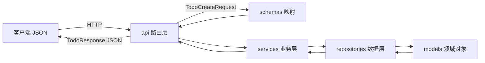

# FastAPI 三层架构 · 极简 Demo

> 通过一个「待办事项」小例子，把 FastAPI 的请求是怎么一层层走下去的讲清楚。

---

## 一、先看目录结构

```
demo/FastAPI_demo/
├── main.py                 # 程序入口，创建 FastAPI 应用
├── api/
│   └── todo_router.py      # 第 1 层：路由（接收 HTTP）
├── services/
│   └── todo_service.py     # 第 2 层：业务逻辑
├── repositories/
│   └── todo_repository.py  # 第 3 层：数据访问（本 demo 用内存列表）
├── schemas/
│   └── todo_schema.py      # 数据映射（JSON ↔ 程序对象）
└── models/
    └── todo.py             # 领域模型（程序内部的数据结构）
```

---

## 二、三层架构是什么？

把后端想成一家餐厅：

| 层 | 文件夹 | 角色 | 做什么 | 不做什么 |
|----|--------|------|--------|----------|
| **路由层** | `api/` | 前台 | 接 HTTP 请求、返回 JSON | 不写业务规则、不直接查库 |
| **业务层** | `services/` | 后厨 | 业务规则、调用数据层 | 不关心 URL 是 GET 还是 POST |
| **数据层** | `repositories/` | 仓库 | 增删改查数据 | 不管「标题能不能为空」这类业务 |

另外还有两个辅助层：

- **`schemas/`**：数据映射 —— 把客户端的 JSON 校验后变成 Python 对象，再把结果转成 JSON 返回。
- **`models/`**：领域模型 —— 程序内部用的数据结构（本 demo 用 `dataclass`，正式项目常用 SQLAlchemy ORM）。

---

## 三、一次请求的完整旅程

以 **创建待办** 为例：`POST /todos`，请求体 `{"title": "学 FastAPI"}`

```
浏览器 / Postman
    │  HTTP POST + JSON
    ▼
┌─────────────────────────────────────────────────────────┐
│  main.py                                                │
│  app 收到请求，根据 URL 找到 todo_router                │
└─────────────────────────────────────────────────────────┘
    │
    ▼
┌─────────────────────────────────────────────────────────┐
│  第 1 层 · api/todo_router.py                           │
│  @router.post("")                                       │
│  def create_todo(req: TodoCreateRequest):               │
│      return todo_service.create_todo(req)               │
│                                                         │
│  FastAPI 自动：解析 JSON → 校验 → 转成 TodoCreateRequest │
└─────────────────────────────────────────────────────────┘
    │
    ▼
┌─────────────────────────────────────────────────────────┐
│  第 2 层 · services/todo_service.py                     │
│  def create_todo(req):                                  │
│      title = req.title.strip()   # 业务：去空格         │
│      return todo_repository.create(title)               │
└─────────────────────────────────────────────────────────┘
    │
    ▼
┌─────────────────────────────────────────────────────────┐
│  第 3 层 · repositories/todo_repository.py              │
│  def create(title):                                     │
│      todo = Todo(id=..., title=title)                   │
│      _fake_db.append(todo)                              │
│      return todo                                        │
└─────────────────────────────────────────────────────────┘
    │
    ▼  原路返回
路由层把 Todo 对象按 TodoResponse 格式序列化成 JSON 返回给客户端
```

---

## 四、FastAPI 核心概念（小白版）

### 1. `FastAPI()` 和 `app`

`main.py` 里的 `app = FastAPI()` 是整个应用的「总机」。所有请求先进 `app`，再分发给具体路由。

### 2. `APIRouter` 和 `@router.get/post/...`

路由就是 **URL + HTTP 方法** 与 **处理函数** 的对应关系：

```python
@router.get("/{todo_id}")   # GET /todos/1
@router.post("")            # POST /todos
```

装饰器里的路径会拼在 `prefix="/todos"` 后面。

### 3. Pydantic Schema（数据映射）

| 类 | 用途 |
|----|------|
| `TodoCreateRequest` | 入参：客户端 POST 什么字段、怎么校验 |
| `TodoUpdateRequest` | 入参：更新时哪些字段可选 |
| `TodoResponse` | 出参：返回给前端的 JSON 长什么样 |

**不用 Schema 的问题**：你要手写 `request.json()`、自己判断类型、自己拼返回字典，容易漏字段、类型错。

**用了 Schema**：FastAPI + Pydantic 自动校验；字段错了直接 422；`response_model` 自动过滤多余字段。

### 4. `response_model`

```python
@router.get("", response_model=list[TodoResponse])
```

告诉 FastAPI：返回值按 `TodoResponse` 的字段输出，并生成 OpenAPI 文档。

### 5. 依赖注入 `Depends`（本 demo 未用，正式项目常见）

正式项目里常见：

```python
async def list_memos(db: AsyncSession = Depends(get_db), user: User = Depends(get_current_user)):
```

`Depends` 表示「调用这个接口前，先自动执行 get_db / get_current_user，把结果传进来」。本 demo 为极简未引入数据库，你在 `server/app/api/memos.py` 里能看到完整用法。

### 6. 自动文档 `/docs`

启动后访问 http://127.0.0.1:8000/docs ，FastAPI 根据路由和 Schema **自动生成** Swagger 界面，可直接点「Try it out」测接口。

---

## 五、和本仓库正式后端的对应关系

| Demo | 正式项目 `server/app/` |
|------|------------------------|
| `api/todo_router.py` | `api/memos.py` |
| `services/todo_service.py` | `services/memo_service.py` |
| `repositories/todo_repository.py` | 合在 service 里用 SQLAlchemy 查询（也可拆 repository） |
| `schemas/todo_schema.py` | `schemas/memo.py` |
| `models/todo.py` | `models/memo.py`（SQLAlchemy ORM） |

正式项目多了：数据库、用户认证、统一响应格式 `success()` 等，但 **分层思路相同**。

---

## 六、如何运行

在仓库根目录 `wizzy/` 下：

```bash
pip install -r demo/FastAPI_demo/requirements.txt
uvicorn demo.FastAPI_demo.main:app --reload
```

浏览器打开：

- 文档与测试：http://127.0.0.1:8000/docs
- 根路径：http://127.0.0.1:8000/

### 用 curl 快速试

```bash
# 创建
curl -X POST http://127.0.0.1:8000/todos -H "Content-Type: application/json" -d "{\"title\":\"学三层架构\"}"

# 列表
curl http://127.0.0.1:8000/todos

# 更新
curl -X PUT http://127.0.0.1:8000/todos/1 -H "Content-Type: application/json" -d "{\"done\":true}"

# 删除
curl -X DELETE http://127.0.0.1:8000/todos/1
```

---

## 七、建议学习顺序

1. 读 `main.py` —— 应用怎么启动、路由怎么挂载
2. 读 `api/todo_router.py` —— HTTP 入口
3. 读 `schemas/todo_schema.py` —— JSON 和对象的映射
4. 读 `services/todo_service.py` —— 业务放哪
5. 读 `repositories/todo_repository.py` —— 数据怎么存取
6. 对照 `server/app/api/memos.py` 看正式项目同一套模式

---

## 八、一张图总结



**记住一句话**：路由只接线，业务在后厨，数据在仓库，Schema 是出入境表格。
