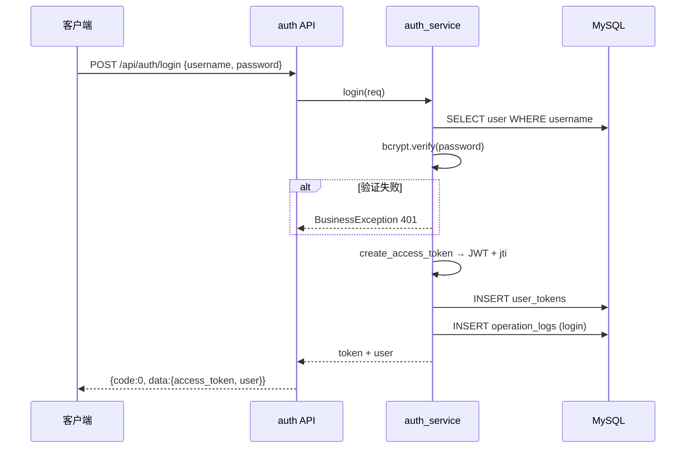
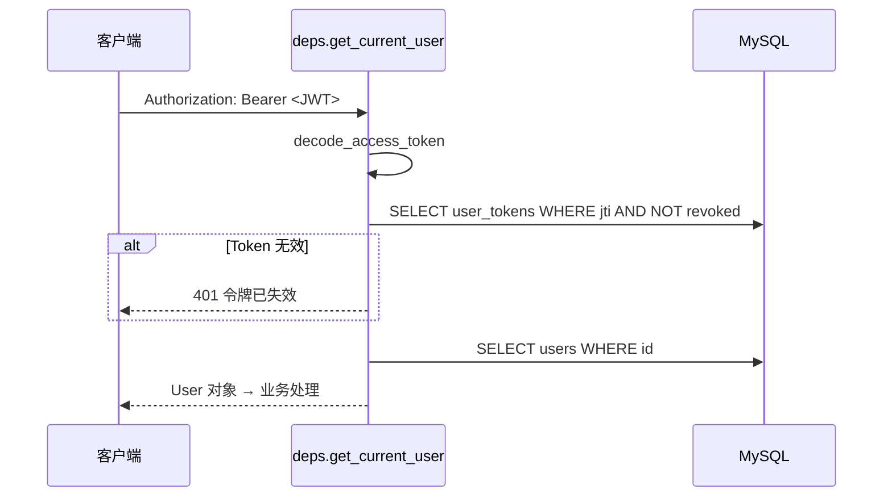

# 后端程序流程

## 1. 应用启动流程

```
main.py
  ├── 创建 FastAPI 实例
  ├── 注册 CORS 中间件
  ├── 注册全局异常处理器
  ├── 挂载 API 路由 (/api/auth, /api/users, ...)
  └── lifespan: 初始化 logging
```

## 2. 登录流程



## 3. 鉴权请求流程



## 4. 备忘录 CRUD 流程

```
GET  /api/memos          → memo_service.list_memos (分页+关键词+分类)
POST /api/memos          → memo_service.create_memo
PUT  /api/memos/{id}     → memo_service.update_memo (校验 user_id)
DELETE /api/memos/{id}   → memo_service.delete_memo
GET  /api/memos/{id}/export-pdf → pdf_generator.generate_memo_pdf → StreamingResponse
```

## 5. 密码本敏感操作流程

```
列表 GET /api/passwords
  → 返回 password_masked="****"（不解密）

查看 POST /api/passwords/{id}/reveal
  → verify_password(登录密码)
  → aes_decrypt(password_enc)
  → log_operation("view_password")
  → 返回明文

导出 GET /api/passwords/export/backup
  → 返回 AES 加密后的 JSON
  → log_operation("export")
```

## 6. 待办逾期判定流程

```
list_todos 查询时：
  is_overdue = due_at < now() AND status NOT IN (completed, cancelled)

overdue_only=true 筛选：
  SQL WHERE due_at < NOW() AND status NOT IN ('completed','cancelled')
```

## 7. 用户管理流程（admin）

```
GET    /api/users              → 分页列表
POST   /api/users              → 创建（bcrypt 哈希密码）
PUT    /api/users/{id}         → 更新角色/状态（禁用 → revoke tokens）
DELETE /api/users/{id}         → 删除（不可删自己）
POST   /api/users/{id}/reset-password → 重置密码 + revoke tokens
```

## 8. 数据库事务

- 每个请求通过 `get_db` 依赖获取 AsyncSession
- 请求成功自动 commit，异常自动 rollback
- 批量待办更新使用单条 UPDATE 语句保证原子性

## 9. 错误处理流程

```
BusinessException → {code: 4xx, message: "业务错误"}
ValidationError   → FastAPI 自动 422
Exception         → {code: 500, message: "服务器内部错误"}
401               → 前端 Axios 拦截器跳转登录
```
