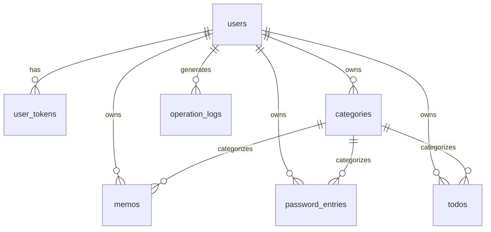

# 数据库说明

## 1. 基本信息

- **数据库名**：wizzy_db
- **字符集**：utf8mb4 / utf8mb4_unicode_ci
- **引擎**：InnoDB
- **版本要求**：MySQL 5.7+

## 2. ER 关系



## 3. 表结构

### users — 用户表

| 字段 | 类型 | 说明 |
|------|------|------|
| id | INT PK AUTO | 主键 |
| username | VARCHAR(50) UNIQUE | 用户名 |
| password_hash | VARCHAR(255) | Bcrypt 哈希 |
| role | VARCHAR(20) | admin / user |
| is_active | TINYINT(1) | 是否启用 |
| created_at | DATETIME | 创建时间 |
| updated_at | DATETIME | 更新时间 |

### user_tokens — JWT 令牌表

| 字段 | 类型 | 说明 |
|------|------|------|
| id | INT PK AUTO | 主键 |
| user_id | INT FK | 关联 users.id |
| jti | VARCHAR(64) UNIQUE | JWT 唯一标识 |
| expires_at | DATETIME | 过期时间 |
| is_revoked | TINYINT(1) | 是否已撤销 |
| created_at | DATETIME | 创建时间 |

### categories — 分类表

| 字段 | 类型 | 说明 |
|------|------|------|
| id | INT PK AUTO | 主键 |
| user_id | INT FK | 所属用户 |
| module_type | VARCHAR(20) | memo / password / todo |
| name | VARCHAR(100) | 分类名称 |
| created_at | DATETIME | 创建时间 |

### memos — 备忘录表

| 字段 | 类型 | 说明 |
|------|------|------|
| id | INT PK AUTO | 主键 |
| user_id | INT FK | 所属用户 |
| category_id | INT FK NULL | 分类 |
| title | VARCHAR(200) | 标题 |
| content | TEXT | 内容 |
| is_pinned | TINYINT(1) | 是否置顶 |
| created_at / updated_at | DATETIME | 时间戳 |

### password_entries — 密码本表

| 字段 | 类型 | 说明 |
|------|------|------|
| id | INT PK AUTO | 主键 |
| user_id | INT FK | 所属用户 |
| category_id | INT FK NULL | 分类 |
| site_name | VARCHAR(200) | 网站/应用名 |
| username | VARCHAR(200) | 登录用户名 |
| password_enc | TEXT | AES 加密密码 |
| url | VARCHAR(500) | 网址 |
| remark | TEXT | 备注 |
| created_at / updated_at | DATETIME | 时间戳 |

### todos — 待办表

| 字段 | 类型 | 说明 |
|------|------|------|
| id | INT PK AUTO | 主键 |
| user_id | INT FK | 所属用户 |
| category_id | INT FK NULL | 分类 |
| title | VARCHAR(200) | 标题 |
| description | TEXT | 描述 |
| priority | VARCHAR(20) | low / medium / high |
| status | VARCHAR(20) | pending / in_progress / completed / cancelled |
| due_at | DATETIME NULL | 截止时间 |
| completed_at | DATETIME NULL | 完成时间 |
| created_at / updated_at | DATETIME | 时间戳 |

### operation_logs — 操作日志表

| 字段 | 类型 | 说明 |
|------|------|------|
| id | INT PK AUTO | 主键 |
| user_id | INT FK | 操作用户 |
| action | VARCHAR(50) | 操作类型 |
| module | VARCHAR(50) | 模块名 |
| detail | TEXT | 详情 |
| ip | VARCHAR(50) | 客户端 IP |
| created_at | DATETIME | 操作时间 |

## 4. 初始化

```bash
# 建表
mysql -u root -p < server/scripts/init_db.sql

# 种子数据（含 admin/user 账号及示例数据）
cd server && python scripts/seed_data.py
```

## 5. 预置数据

| 用户 | 密码 | 角色 | 示例数据 |
|------|------|------|----------|
| admin | Admin@123 | admin | 3 备忘录、2 密码、4 待办 |
| user | User@123 | user | 3 备忘录、2 密码、4 待办 |

每个用户各有一个 memo/password/todo 分类。

## 6. 索引策略

- 所有 `user_id` 字段建立索引（行级隔离查询）
- `user_tokens.jti` 唯一索引（Token 校验）
- `users.username` 唯一索引（登录查询）
- `categories(user_id, module_type)` 联合索引
